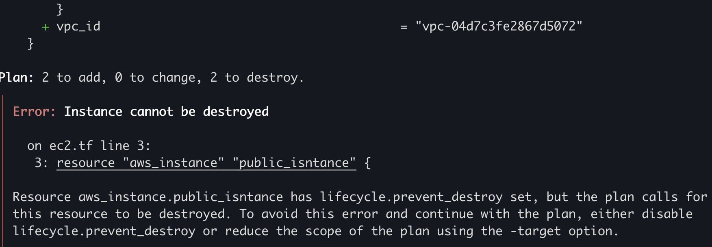

# 2-Seccion-Principal
1. [Terraform State](#schema1)
2. [Comandos en Terraform](#schema2)
3. [Lifecycles](#schema3)
4. [ Practica AWS - Acceder a la instancia publica](#schema4)
5. [Provisioners](#schema5)
6. [Terraform Taint](#schema6)
7. [Logs en Terraform](#schema7)

[REF](#schemaref)

<hr>

<a name="schema1"></a>

## 1. Terraform State

`terraform state` es un archivo que mantiene el registro de la infraestructura gestionada por Terraform. Este archivo es fundamental para el funcionamiento de Terraform, ya que almacena información sobre los recursos creados y su configuración actual, permitiendo a Terraform realizar un seguimiento y gestionar los recursos de manera eficiente y precisa.

### Funciones del Estado de Terraform
- Seguimiento de Recursos:
    - Mantiene un registro de todos los recursos que Terraform ha creado, actualizado o destruido.
    - Almacena los ID de los recursos y sus propiedades actuales.
- Planificación y Aplicación:
    - Permite a Terraform calcular con precisión los cambios necesarios comparando el estado actual con la configuración deseada.
    - Ayuda a evitar la recreación innecesaria de recursos.
- Depuración y Diagnóstico:
    - Proporciona una fuente de verdad sobre el estado de la infraestructura, facilitando la depuración y resolución de problemas.
- Modularidad:
    - Permite compartir datos entre diferentes módulos de Terraform.


### Ubicación del Estado
Por defecto, el estado se almacena localmente en un archivo llamado `terraform.tfstate` en el directorio donde se ejecuta Terraform. Sin embargo, para equipos grandes o entornos de producción, es recomendable usar un backend remoto para almacenar el estado, como Amazon S3, Terraform Cloud, Google Cloud Storage, entre otros.

### Comandos Relacionados con el Estado
Terraform proporciona varios comandos para interactuar con el estado:

- terraform init:
    - Inicializa el directorio de trabajo y configura el backend remoto si está especificado.
- terraform state list:
    - Lista todos los recursos en el estado.
        ```sh
        terraform state list
        ```
- terraform state show:
    - Muestra los detalles de un recurso específico en el estado.
        ```sh
        terraform state show aws_instance.example
        ````

- terraform state mv:
    - Mueve un recurso gestionado de un nombre a otro.
        ```sh
        terraform state mv aws_instance.old_name aws_instance.new_name
        ```
- terraform state rm:
    - Elimina un recurso del estado sin destruir el recurso real.
        ```sh
        terraform state rm aws_instance.example
        ```
- terraform state pull:
    - Descarga el estado actual de Terraform del backend remoto y lo muestra en la salida estándar.
        ```sh
        terraform state pull
        ````

- terraform state push:
    - Sube un archivo de estado al backend remoto.
        ```sh
        terraform state push
        ```


Es conveniente agregar el archivo de estado de Terraform `terraform.tfstate` y sus derivados `terraform.tfstate.backup` al archivo `.gitignor` para evitar que sean incluidos en el control de versiones. Existen varias razones para esto:

### Seguridad:
- El archivo de estado puede contener información sensible, como IDs de recursos, direcciones IP, credenciales, y otros detalles de configuración. Incluir estos archivos en un repositorio puede exponer datos confidenciales.

### Conflictos:
- El estado de Terraform es altamente dinámico y puede cambiar con cada terraform apply. Si múltiples usuarios trabajan en el mismo repositorio y el archivo de estado se versiona, pueden surgir conflictos difíciles de resolver.

### Integridad del Estado:
- El estado de Terraform debe ser una fuente de verdad única y consistente. Versionarlo en Git puede causar inconsistencias y problemas si se restaura una versión antigua del estado que ya no refleja la infraestructura actual.

### Uso de Backends Remotos:
- Cuando se utiliza un backend remoto (como Amazon S3, Terraform Cloud, Google Cloud Storage, etc.), el estado se almacena de manera centralizada y segura, eliminando la necesidad de versionarlo en Git.


Para tener un mayor control de estos archivos dentro de un equipo se podría añadir estos archivos a un `S3` con control de version y cifrado.

#### Ventajas de Usar S3 para el Estado de Terraform
- Consistencia y Coordinación:
    -   Asegura que todos los miembros del equipo trabajen con un estado de infraestructura único y consistente, evitando conflictos y discrepancias.

- Seguridad:
    -S3 permite configurar políticas de acceso y control de permisos, asegurando que solo los usuarios autorizados puedan acceder y modificar el archivo de estado.

- Versionado:
    - S3 puede mantener versiones de archivos, lo que permite recuperar estados anteriores si es necesario.

- Disponibilidad y Durabilidad:
    - S3 ofrece alta disponibilidad y durabilidad, asegurando que el estado esté siempre accesible y protegido contra pérdida de datos.

- Bloqueo de Estado:
    - Con el uso de DynamoDB para el bloqueo de estado, se evita que múltiples usuarios apliquen cambios simultáneamente, lo que previene la corrupción del estado.


#### Resumen
Al almacenar el estado de Terraform en un bucket de S3 con bloqueo de estado en DynamoDB, se mejora la colaboración en equipo, se garantiza la consistencia del estado y se refuerza la seguridad y la disponibilidad del estado de la infraestructura. Esta configuración es altamente recomendada para entornos de trabajo en equipo y producción.

- **Función de DynamoDB:** Gestionar el bloqueo de estado para evitar conflictos y mantener la consistencia del estado cuando múltiples usuarios trabajan en la misma infraestructura.
- **Configuración:** Crear una tabla de DynamoDB y configurar Terraform para usarla junto con el backend de S3.
- **Proceso:** Terraform intenta crear un bloqueo en DynamoDB antes de modificar el estado, asegurando que solo un proceso pueda hacer cambios a la vez.

<hr>

<a name="schema2"></a>


## 2. Comandos en Terraform

### Comandos para Gestión del Ciclo de Vida
- terraform apply:
    - Aplica los cambios necesarios para alcanzar el estado deseado de la configuración.
        ```sh
        terraform apply
        ```

- terraform plan:
    - Genera un plan de ejecución, mostrando los cambios que Terraform hará en la infraestructura.
        ```sh
        terraform plan
        ```
- terraform destroy:
    - Destruye la infraestructura gestionada por Terraform.
        ```sh
        terraform destroy
        ``` 

- terraform refresh:
    - Actualiza el estado de Terraform para que coincida con la infraestructura real.
        ```sh
        terraform refresh
        ```

- terraform init:
    - Inicializa un directorio de trabajo con archivos de configuración de Terraform.
        ```sh
        terraform init
        ```
- terraform validate:
    - Verifica que los archivos de configuración son válidos y que no hay errores de sintaxis.
        ```sh
        terraform validate
        ``` 


### Comandos para Gestión del Estado
- terraform state list:
    - Lista todos los recursos en el estado.
        ```sh
        terraform state list
        ```
- terraform state show:
    - Muestra los detalles de un recurso específico en el estado.
        ```sh
        terraform state show <resource_name>
        ```
- terraform state mv:
    - Mueve un recurso gestionado de un nombre a otro.
        ```sh
        terraform state mv <source> <destination>
        ```
- terraform state rm:
    - Elimina un recurso del estado sin destruir el recurso real.
        ```sh
        terraform state rm <resource_name>
        ```
- terraform state pull:
    - Descarga el estado actual de Terraform del backend remoto.
        ```sh
        terraform state pull
        ```
- terraform state push:
    - Sube un archivo de estado al backend remoto.
        ```sh
        terraform state push
        ```

### Comandos para Gestión de Recursos
- terraform import:
    - Importa recursos existentes en Terraform para que puedan ser gestionados.
        ```sh
        terraform import <resource_type>.<resource_name> <resource_id>
        ```
- terraform taint:
    - Marca un recurso para recrearlo en la próxima aplicación de cambios.
        ```sh
        terraform taint <resource_name>
        ``` 
- terraform untaint:
    - Desmarca un recurso que estaba marcado para recreación.
        ```sh
        terraform untaint <resource_name>
        ```
### Comandos para Optimización y Mantenimiento
- terraform fmt:
    - Formatea todos los archivos de configuración de Terraform en el directorio actual de acuerdo con el estilo de código estándar.
        ```sh
        terraform fmt
        ```
- terraform graph:
    - Genera un gráfico visual de las dependencias de recursos y lo imprime en formato DOT.
        ```sh
        terraform graph | dot -Tpng > graph.png
        ```
- terraform output:
    - Muestra las salidas definidas en la configuración de Terraform.
        ```sh
        terraform output
        ```
- terraform workspace:
    - Gestiona múltiples entornos (workspaces) dentro de una misma configuración.
        ```sh
        terraform workspace list
        terraform workspace new <workspace_name>
        terraform workspace select <workspace_name>
        terraform workspace delete <workspace_name>
        ```
- terraform version:
    - Muestra la versión de Terraform que está siendo utilizada.
        ```sh
        terraform version
        ```
- terraform providers:
    -  Lista los proveedores de infraestructura requeridos por la configuración.
        ```sh
        terraform providers
        ````

### Comandos para Debugging y Troubleshooting
- terraform console:
    - Abre una consola interactiva para evaluar expresiones de Terraform.
        ```sh
        terraform console
        ```
- terraform debug:
    - Ejecuta Terraform en modo debug, proporcionando información detallada para la resolución de problemas.
        ```sh
        TF_LOG=DEBUG terraform apply
        ```
### Otros Comandos Útiles
- terraform login:
    - Autentica con Terraform Cloud para acceder a las funciones avanzadas y almacenamiento de estado remoto.
        ```sh
        terraform login
        ```
- terraform logout:
    - Cierra la sesión de Terraform Cloud.
        ```sh
        terraform logout
        ```
<hr>

<a name="schema3"></a>

## 3. Lifecycles

En Terraform, los `lifecycles` (ciclos de vida) son un conjunto de reglas y configuraciones que se pueden aplicar a recursos individuales para controlar cómo Terraform maneja la creación, actualización y destrucción de esos recursos. Estos bloques permiten personalizar el comportamiento predeterminado de Terraform en varias situaciones, proporcionando un control más granular sobre la gestión de la infraestructura.


### Componentes del lifecycle en Terraform
El bloque lifecycle se coloca dentro de la configuración de un recurso y puede contener las siguientes propiedades clave:

- create_before_destroy:
    - Esta propiedad se utiliza para forzar a Terraform a crear un recurso nuevo antes de destruir el recurso existente. Es útil en casos donde el recurso antiguo necesita permanecer activo hasta que el nuevo esté completamente configurado.

    - Valor predeterminado: false

        ```hcl
        resource "aws_instance" "example" {
        ami           = "ami-123456"
        instance_type = "t2.micro"
        
        lifecycle {
            create_before_destroy = true
        }
        }
        ```
- prevent_destroy:
    - Esta propiedad evita que el recurso sea destruido accidentalmente. Si se intenta ejecutar un terraform destroy o una operación que implicaría la destrucción del recurso, Terraform lanzará un error y detendrá la ejecución.
    - Valor predeterminado: false

        ```hcl
        resource "aws_s3_bucket" "example" {
        bucket = "my-precious-bucket"
        
        lifecycle {
            prevent_destroy = true
        }
        }
        ```
- ignore_changes:
    - Esta propiedad le indica a Terraform que ignore cambios específicos en los atributos de un recurso cuando realice un terraform plan o terraform apply. Es útil cuando ciertos atributos son gestionados externamente o cuando no se desea que ciertos cambios provoquen una nueva aplicación.

        ```hcl
        resource "aws_instance" "example" {
        ami           = "ami-123456"
        instance_type = "t2.micro"
        
        lifecycle {
            ignore_changes = [
            tags["Name"],
            user_data,
            ]
        }
        }
        ```
    - En este ejemplo, si los tags o el user_data cambian fuera de Terraform, Terraform no intentará volver a aplicar esos cambios.

- replace_triggered_by:
    - Esta propiedad permite especificar que un recurso debe ser recreado si otro recurso o una variable cambia. Esta es una característica avanzada que te permite controlar la recreación de recursos en función de cambios en otros elementos de la configuración.


        ```hcl
        resource "aws_instance" "example" {
        ami           = "ami-123456"
        instance_type = "t2.micro"
        
        lifecycle {
            replace_triggered_by = [
            var.new_ami_id,
            aws_security_group.example.id,
            ]
        }
        }
        ```
    - En este caso, si el valor de `var.new_ami_id` o el ID del grupo de seguridad `aws_security_group.example` cambia, Terraform recreará la instancia aws_instance.example.

[Código de ejemplo](/practica_6/)
- `terraform apply`
- cambiamos esta linea en el archivo `ec2.tf`: 
```
  subnet_id =  aws_subnet.private_subnet.id 
```
- y hacemos un `terraform plan`, vemos que destruye la instancia y la crea de nuevo. Ahora vamos a ver como podemos hacer los con lifecycle.
- Vamos a usar `create_before_destroy` para que nos cree el recurso primero antes de destruirlo.
- Otro comando que podemos usar es el `prevent_destroy`.

Nos da un error porque este comando evita que sea destruido el recurso y como en nuestro caso tenemos que destruirlo para crearlo de nuevo por eso nos da este error.
- `ignore_changes`: ignore cambios específicos en los atributos de un recurso cuando realice un terraform plan o terraform apply.
```
lifecycle {
    ignore_changes = [ ami,subnet_id ]
  }
```
Al añadir estas líneas esta ignorando si hay algún cambio en el `ami` y en la `subnet_id`, como el ejercicio que estamos haciendo es de cambio en esta subnet_id, ignora totalmente ese cambio.
- `replace_triggered_by`:recurso debe ser recreado si otro recurso o una variable cambia.
```
  lifecycle {
    replace_triggered_by = [ 
      aws_subnet.private_subnet
     ]
  }
```
Si hacemos algún cambio en la subnet privada hara que se destruya y cree de nuevo la instacia EC2.

<hr>

<a name="schema4"></a>

## 4. Practica AWS - Acceder a la instancia pública

Nos faltan recursos para poder conectarnos desde internet a nuestra instancia en nuestra subnet pública.

### Recursos que nos faltan:
- **Internet gateway:** punto de entrada y salida, desde internet hacia los recursos y de los recursos hacia internet.

    - El recurso `aws_internet_gateway` en Terraform se refiere específicamente a un Internet Gateway (IGW) en AWS, que es un componente de red específico en Amazon VPC. Sin embargo, AWS ofrece varios tipos de "gateways" y es importante diferenciarlos.
- **Tabla de enrutamiento:**
En AWS, una tabla de rutas `route table` es un componente fundamental dentro de la Virtual Private Cloud (VPC) que define cómo se enruta el tráfico de red dentro de la VPC. Una tabla de rutas contiene un conjunto de reglas (rutas) que determinan hacia dónde se debe enviar el tráfico de red basado en la dirección IP de destino.


- **aws_route_table_association.example_association:**

    - Asocia la tabla de rutas creada con la subnet. Esto asegura que el tráfico saliente de la subnet siga las reglas definidas en la tabla de rutas.

- **Security group**

El recurso de Security Group en AWS es un componente crucial de la seguridad en la nube, utilizado para controlar el tráfico entrante y saliente de las instancias EC2 (y otros recursos compatibles) en una VPC. Los Security Groups actúan como firewalls virtuales que definen qué tráfico está permitido hacia o desde los recursos asociados.


### ¿Qué es un Internet Gateway (IGW)?
- Un Internet Gateway es un componente que permite que los recursos en una VPC puedan comunicarse con Internet. Es un punto de entrada y salida entre la VPC y el Internet. Los Internet Gateways son esenciales para que las instancias EC2 y otros recursos dentro de una VPC puedan recibir y enviar tráfico a través de Internet.

### Características principales del Internet Gateway:
- Entrada y Salida de Tráfico:

    - Permite a las instancias en subnets públicas de una VPC enviar y recibir tráfico desde y hacia Internet.
- Redundancia y Alta Disponibilidad:

   - El Internet Gateway es altamente disponible y tolerante a fallos, escalando automáticamente para gestionar el tráfico.
- Requisitos para el Tráfico Saliente:

    - Las instancias deben tener una dirección IP pública o una Elastic IP y deben estar en una subnet asociada con una tabla de rutas que apunte al IGW para que el tráfico saliente funcione.


### ¿Qué es una Tabla de Rutas en AWS?
- Función: La tabla de rutas especifica cómo el tráfico de red desde las subnets (y, por extensión, desde las instancias dentro de esas subnets) debe ser dirigido. Cada subnet dentro de una VPC está asociada a una tabla de rutas, que puede ser la tabla de rutas predeterminada de la VPC o una personalizada.

- Componentes: Cada entrada en una tabla de rutas incluye:

    - Destino (Destination): Un rango de direcciones IP (CIDR) que define el destino del tráfico.
    - Target (Destino): El recurso al que debe enviarse el tráfico destinado, como un Internet Gateway, una NAT Gateway, una instancia EC2, o un Transit Gateway.


### ¿Qué es un Security Group en AWS?
- Función: Los Security Groups controlan el tráfico de red a nivel de instancia, es decir, definen las reglas que permiten o bloquean el tráfico entrante y saliente en función de varios criterios, como el puerto, el protocolo, y las direcciones IP de origen o destino.

- Estado: Los Security Groups son stateful, lo que significa que si permites el tráfico entrante, la respuesta correspondiente es permitida automáticamente (no es necesario definir reglas de salida separadas para la respuesta).

- Reglas de Seguridad:

    - Reglas de Ingreso (Inbound Rules): Controlan el tráfico que se permite entrar a las instancias.
    - Reglas de Egreso (Outbound Rules): Controlan el tráfico que se permite salir de las instancias.

- [DOC Internet Gateway](https://registry.terraform.io/providers/hashicorp/aws/latest/docs/resources/internet_gateway)
- [DOC Route Table](https://registry.terraform.io/providers/hashicorp/aws/latest/docs/resources/route_table) 
- [DOC Route Table Association ](https://registry.terraform.io/providers/hashicorp/aws/latest/docs/resources/route_table_association)
- [DOC Security Group](https://registry.terraform.io/providers/hashicorp/aws/latest/docs/resources/security_group)

<hr>

<a name="schema5"></a>

## 5. Provisioners

Los `provisioners` en Terraform son bloques que se utilizan para ejecutar scripts o comandos locales o remotos en una instancia de recurso, generalmente después de que el recurso ha sido creado o actualizado. Son útiles para realizar configuraciones finales, ejecutar scripts de arranque, instalar software, o realizar cualquier otra tarea que necesite ejecutarse en el recurso una vez que esté disponible.


### Tipos de Provisioners
Terraform soporta varios tipos de provisioners, incluyendo:

- local-exec Provisioner:

    - Ejecuta comandos o scripts en la máquina local donde se está ejecutando Terraform.
    - Útil para tareas como invocar comandos del sistema o scripts locales después de crear un recurso.
        ```hcl
        resource "aws_instance" "example" {
        ami           = "ami-123456"
        instance_type = "t2.micro"

        provisioner "local-exec" {
            command = "echo ${aws_instance.example.public_ip} >> ip_addresses.txt"
        }
        }
        ```    
- remote-exec Provisioner:

- Ejecuta comandos o scripts en la máquina remota (como una instancia EC2) después de que el recurso ha sido creado.
- Utiliza SSH o WinRM para conectarse a la instancia.
        ```hcl
        resource "aws_instance" "example" {
        ami           = "ami-123456"
        instance_type = "t2.micro"

        connection {
            type        = "ssh"
            user        = "ubuntu"
            private_key = file("~/.ssh/id_rsa")
            host        = self.public_ip
        }

        provisioner "remote-exec" {
            inline = [
            "sudo apt-get update",
            "sudo apt-get install -y nginx",
            ]
        }
        }
        ```
- file Provisioner:

    - Sirve para transferir archivos o directorios desde la máquina local a la máquina remota.
    - Utiliza la misma configuración de conexión que el remote-exec.
        ```hcl
        resource "aws_instance" "example" {
        ami           = "ami-123456"
        instance_type = "t2.micro"

        connection {
            type        = "ssh"
            user        = "ubuntu"
            private_key = file("~/.ssh/id_rsa")
            host        = self.public_ip
        }

        provisioner "file" {
            source      = "index.html"
            destination = "/var/www/html/index.html"
        }
        }
        ```

- Orden de Ejecución
    - Los provisioners se ejecutan después de que el recurso ha sido creado. Si el recurso no se puede crear (por ejemplo, si la instancia EC2 no se inicia correctamente), los provisioners no se ejecutarán.

- Fallos y Reintentos
    - Por defecto, si un provisioner falla, Terraform marcará el recurso como fallido y no continuará con la ejecución. Puedes cambiar este comportamiento usando el atributo on_failure.

    ```hcl
    provisioner "remote-exec" {
    inline = [
        "some-failing-command",
    ]

    on_failure = "continue"  # Las opciones son "continue" o "fail"
    }
    ```
### Casos de Uso Comunes
- Configuración de Software: Instalar paquetes, configurar servicios, o desplegar aplicaciones una vez que la instancia está activa.
- Transferencia de Archivos: Copiar archivos de configuración, scripts, o cualquier otro recurso necesario a la instancia.
- Notificaciones: Ejecutar comandos que notifiquen a otros sistemas que el recurso está disponible o que la configuración ha terminado.
- Ejecutar Scripts de Shell: Ejecutar scripts de shell complejos en la instancia para realizar tareas específicas.
### Consideraciones y Buenas Prácticas
- Provisioners como último recurso: Terraform recomienda usar provisioners solo cuando no es posible lograr el mismo resultado a través de recursos declarativos nativos de Terraform o cuando necesitas realizar una tarea específica de configuración.
- Idempotencia: Asegúrate de que los scripts que ejecutas con provisioners sean idempotentes, es decir, que puedan ejecutarse varias veces sin causar efectos adversos.
- Alternativas a los provisioners: Siempre que sea posible, es preferible usar recursos específicos de Terraform o herramientas de configuración de administración como Ansible, Chef, o Puppet, que están mejor equipadas para gestionar la configuración de instancias.
### Resumen
Los `provisioners` en Terraform son herramientas poderosas para ejecutar comandos o scripts en máquinas locales o remotas durante la creación de recursos. Aunque son útiles para configuraciones finales y tareas post-creación, deben usarse con precaución, ya que introducen imperativos en un flujo declarativo. Terraform recomienda que los `provisioners` sean utilizados solo cuando sea absolutamente necesario y cuando no existan alternativas declarativas más adecuadas.


<hr>

<a name="schema6"></a>

## 6. Terraform Taint


El comando `terraform taint` en Terraform se utiliza para marcar un recurso como "dañado" `tainted`. Esto indica que el recurso debe ser recreado en la próxima ejecución del plan de Terraform. Es una forma de forzar la recreación de un recurso sin necesidad de hacer cambios en la configuración.

### ¿Qué es terraform taint?
- Objetivo: terraform taint marca un recurso como "dañado" para que Terraform lo recree. 
    - Esto es útil en situaciones en las que el recurso está en un estado problemático o no deseado y se necesita recrear desde cero.

- Funcionamiento: Cuando un recurso es marcado como dañado, Terraform lo incluirá en la lista de recursos que deben ser destruidos y recreados en la próxima ejecución del plan. El recurso será destruido y luego creado de nuevo con la configuración actual.

### Uso Básico
- Aquí está un ejemplo básico de cómo se usa el comando terraform taint:

```sh
terraform taint aws_instance.example
```
- Este comando marca el recurso aws_instance.example como dañado. En la siguiente ejecución de terraform apply, Terraform destruirá esta instancia y la creará nuevamente.


<hr>

<a name="schema7"></a>

## 7. Logs en Terraform

En Terraform, los logs son una herramienta crucial para la depuración y el monitoreo del proceso de provisión y gestión de la infraestructura. Proporcionan información detallada sobre las operaciones realizadas por Terraform, como la creación, modificación y destrucción de recursos.

### Tipos de Logs en Terraform
- Logs de Ejecución:

    - Estos logs muestran la salida estándar de los comandos de Terraform (terraform apply, terraform plan, etc.). Incluyen información sobre las acciones que Terraform está llevando a cabo, así como el estado de los recursos.
- Logs de Depuración:

    - Terraform permite habilitar un modo de depuración detallado que proporciona una visión más profunda sobre lo que está ocurriendo bajo el capó. Estos logs pueden ser muy útiles para solucionar problemas complejos y entender cómo Terraform interactúa con los proveedores y recursos.
### Configuración de Logs en Terraform
- Habilitar Logs de Depuración
    - Para habilitar el modo de depuración en Terraform, se utiliza la variable de entorno TF_LOG. Esta variable controla el nivel de detalle de los logs generados por Terraform.

- Niveles de Log Disponibles:
    - TRACE: Proporciona el nivel más detallado de información de depuración.
    - DEBUG: Muestra detalles extensos sobre la operación de Terraform, pero menos detallado que TRACE.
    - INFO: Proporciona información general sobre las operaciones de Terraform, ideal para la mayoría de los casos de uso.
    - WARN: Muestra advertencias que pueden indicar problemas potenciales.
    - ERROR: Muestra solo los errores críticos que impiden que Terraform ejecute las operaciones correctamente.
### Ejemplo de configuración:

```sh
export TF_LOG=DEBUG
```
- Una vez que hayas establecido TF_LOG, Terraform comenzará a emitir logs en la salida estándar. Puedes redirigir estos logs a un archivo para análisis posterior:

```sh
export TF_LOG=DEBUG
terraform apply > terraform_debug.log 2>&1
```
Esto redirige tanto la salida estándar como los errores al archivo terraform_debug.log.

### Configuración de la Variable TF_LOG_PATH
- Si prefieres guardar los logs en un archivo específico, puedes usar la variable de entorno TF_LOG_PATH para definir la ruta del archivo de log.

Ejemplo:

```sh
export TF_LOG_PATH="/path/to/terraform.log"
```
o guardar el archivo en un .txt
```sh
export TF_LOG_PATH=logs.txt
```
- Con esta configuración, Terraform escribirá los logs en el archivo especificado, lo que facilita la revisión y análisis posterior.

### Ejemplos de Uso
- Depuración de Problemas:
    - Si encuentras un error al ejecutar terraform apply, puedes habilitar los logs de depuración para obtener más detalles sobre lo que está fallando.
### Monitorización y Auditoría:
- Para una auditoría completa de las operaciones de Terraform o para monitorear cambios y actividades, puedes revisar los logs generados.
### Análisis de Desempeño:
- Los logs detallados pueden ayudar a identificar cuellos de botella o problemas de rendimiento en la provisión de recursos.
### Resumen
En Terraform, los logs son esenciales para depurar y entender el comportamiento de las operaciones de infraestructura. Puedes habilitar diferentes niveles de logging usando la variable de entorno TF_LOG y redirigir los logs a archivos específicos con TF_LOG_PATH. Los logs detallados pueden ayudar a resolver problemas complejos, monitorear operaciones y auditar actividades, proporcionando una visión más profunda del funcionamiento interno de Terraform.

### Eliminar las variables
- Obtener las variables `TF_LOG`
```
env | grep TF_LOG
```
- Eliminar las variables
```
unset TF_LOG
``` 